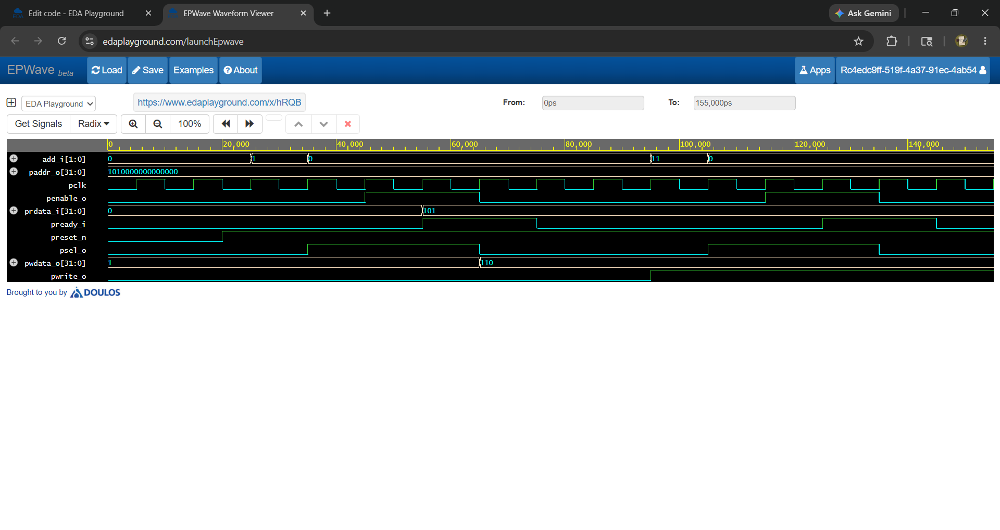

# Design and Verification of an APB Master Controller Using SystemVerilog

## Overview

This project implements an APB (Advanced Peripheral Bus) Master Controller using SystemVerilog. The controller generates APB bus transactions and supports read and write operations according to the AMBA APB protocol. Functional verification was performed using a SystemVerilog testbench and simulation waveform analysis.

## Features

* APB Master Controller implementation
* APB Read Transaction Support
* APB Write Transaction Support
* Finite State Machine (FSM)-Based Design
* SystemVerilog Testbench for Verification
* Waveform-Based Functional Validation

## Project Structure

* APB_Master_Controller/

* ├── apb_add_master.sv

* ├── apb_slave_tb.sv

* ├── waveform.png

* └── README.md

## APB Signals

| Signal  | Description            |
| ------- | ---------------------- |
| PCLK    | APB Clock              |
| PRESETn | Active-Low Reset       |
| PSEL    | Slave Select Signal    |
| PENABLE | Transfer Enable Signal |
| PADDR   | Address Bus            |
| PWRITE  | Read/Write Control     |
| PWDATA  | Write Data Bus         |
| PRDATA  | Read Data Bus          |

## Tools Used

* SystemVerilog
* Icarus Verilog
* EDA Playground

## Results

The APB Master Controller was successfully simulated and verified. The generated waveform confirms proper APB protocol operation, including setup phase, access phase, and successful read/write transactions.

## Waveform

## Applications

* System-on-Chip (SoC) Design
* Embedded Systems
* AMBA-Based Peripheral Communication
* Digital Design and Verification

## Author

* Meghana Peddinti
* B.Tech – Electronics and Communication Engineering
